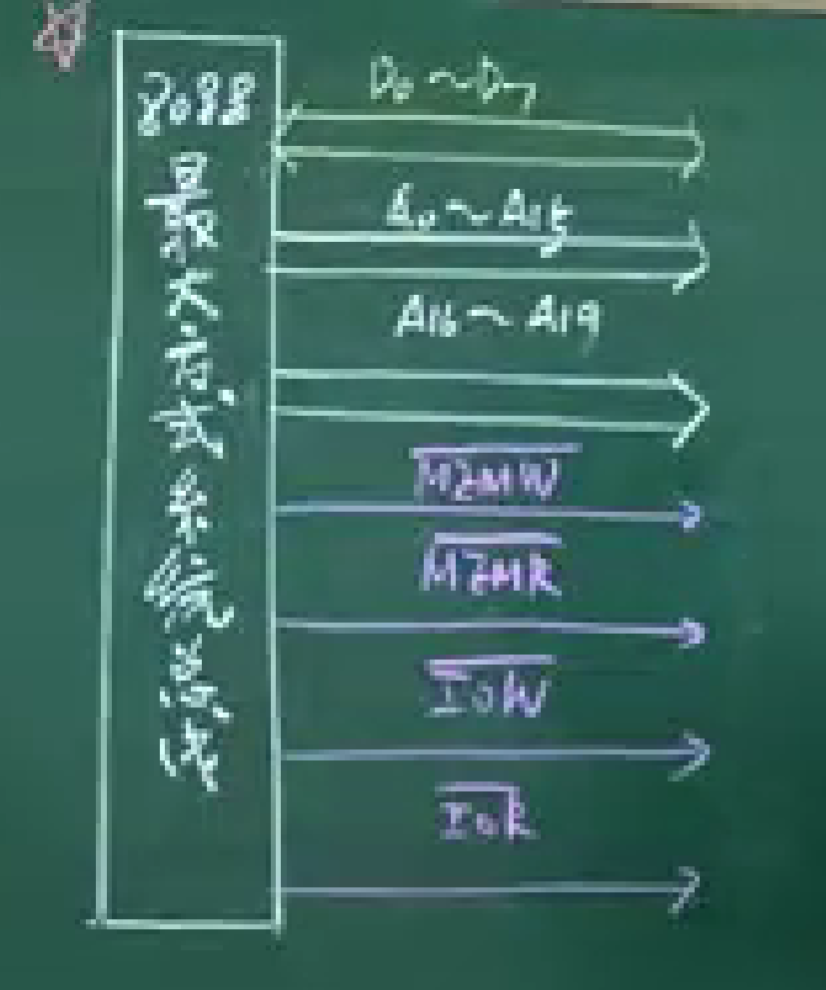

# 前言
 
课程链接：[微机原理 （西安电子科技大学）_哔哩哔哩_bilibili](https://www.bilibili.com/video/BV1ZJ411b7Na?spm_id_from=333.999.0.0&vd_source=f6d522f28072721da0e962ed83629041)

关联课程：[微机原理（实体上课）](微机原理（实体上课）.md) [2020 西电计算机组成与体系结构 车向泉](../自学内容/计算机/计算机组成原理/2020%20西电计算机组成与体系结构%20车向泉.md)

# 课程笔记

## 第0章 绪论

### 1. 课程内容安排

- 对应教材第一至十章，前四章为软件部分，后续为硬件部分。
- 物理量->（传感器）->电量（mv）->前端调理电路（电路放大与滤波）->AD变换器（速度，精度）->CPU（8086）（包括存储器）->显示/DA转换器（**此处为接口电路**）->后端调理电路
- CPU->AD变换器（控制命令） CPU->前端调理电路


### 2. 微型计算机系统组成（硬件子系统）
1. 早期计算机硬件组成


- ALU+控制器=中央处理器CPU、微处理器
- 信息：控制信息，数据信息，地址信息。
- 总线：用来传输信息的通路。 对应三条信息，有三种总线。
	- 数据总线（DB）
	- 地址总线（AB）
	- 控制总线（CB）

2. 微型计算机硬件组成
- 复用引脚
- 数据总线为双向，地址总线为单向，控制总线为双向。
- CPU的复用引脚经过**系统总线形成电路**作用，转化为**系统（级）总线**（负责驱动各个负载设备）传输信息。
- **系统总线形成电路**不仅解决了引脚复用问题，还解决了总线驱动能力的问题。
- 微处理器引脚构成的总线称为微处理级总线（驱动负载能力较弱）。


- 存储器：ROM、RAM
	- ROM：掉电后不丢失，存放系统管理程序。（BIOS）     故也称为程序存储器。
	- RAM：掉电后信息丢失，能读能写。                                    故也称为数据存储器。


- 指令：一组二进制代码。  =>机器语言


- 任何I/O设备与CPU之间不能直接通讯。需要设计I/O接口电路。
- I/O接口地址：给I/O接口电路分配的地址。
- I/O地址译码电路：确定选择的是哪个I/O接口电路。


### 3. 存储器
- 存储器按字节组成（8位）
- 每个单元都有其地址码
- 寻址方式越多，汇编语言程序书写越灵活。
- 任意两个相邻的字节单元，可以组成一个字单元。一个字单元分为低字节和高字节。


## 第一章 数制与码制

### 1. 数制间的相互转换

- 十进制转二进制——权逼近法
- 二进制转十进制——位置加权法


- 十进制转十六进制——除十六取值法 或 十进制转二进制转十六进制
- 十六进制转十进制

- 在程序设计中 ：
	- 二进制转十进制：除k取余法（k为位数）、比较法
	- 十进制转二进制：


### 2. 二进制数的运算

- +/-  运算更重要
- 寄存器在CPU内部，暂存数据。
	- 8位寄存器（字节型寄存器）
- 处理器状态字寄存器（PSW）=> 标志寄存器 （只要运算，就影响PSW）
	- **PF只看结果的低八位**。目的：实现计算机的串行通信。实现奇校验/偶校验。
	- AF 半进位/半借位（也称为辅助进位/辅助借位，用于BCD数运算）

- 目的操作数：DST（destination），原操作数：SRC（Source）
- 有效地址：EA（Effect Address）

- 逻辑运算
	- 与     AND  DST，SRC     应用场合：部分位清零，其余位不变。
		- 注意，表示数字最高位必须补0。
	- 或     OR    DST， SRC      应用场合：部分位置1，其余位不变。
	- 异或  XOR DST，SRC      应用场合：部分位取反，其余位不变。
	- 非     NOT DST      （对PSW的状态标志均无影响）


### 3. 有符号数的表示方法与溢出问题

- 无符号数表示范围：n=8： 0-255 （00H-FFH）  n=16：0-65535（0000H-FFFFH）
- 有符号数的表示：机器数表示法（8位数中，后7位作为数值，最高位作为符号位）

1. 原码（+0，-0结果不同，不采用）
2. 补码（求法与计组一致）
- 在计算机中，有符号数均用补码表示。
- 补码的范围：-128-+127    -32767- +32768


3. 补码的运算
- 【X+Y】补=【X】补+【Y】补
- 【X-Y】补=【X】补-【Y】补
- 【X-Y】补=【X】补+【（-Y）】补
	- 减法变成加法：加法器更加简单，提高运算速度且简化ALU电路设计。
- 注意事项：
	- 补码表示的数，运算后结果仍然为补码。（补码的补码是原码）
	- 已知【Y】补，求【（-Y）】补。
		- 从右往左找第一个1，其前位按位取反（变补/求负）

4. 表示BCD数的方法（方法不同，调整也不同）
- 组合BCD数（压缩BCD数）：放在一个字节内
- 分离BCD数：放在两个字节（第一个后面，第二个前面）

- 例如：53+28
- 组合BCD数：01010011B+00101000B=01111011B（错误）
	- 修正：1011 **大于9小于16**，故加6使其进位。 （分别测CF，AF确定加不加6）
```Asm
	MOV AL 53H   ADD AL 28H DAA
```

5. ASCII码
- 0-9  30H-39H
- 'A' - 'F'  41H- 46H
- 'a' - 'f'  61H-66H
- 字符转化数字-> 与OFH或-30H
- 大写字符转化数字 -> -37H
- 小写字符转大写字符 -> -20H/与DFH  （AND AL 0DFH） 或 与5FH（AND AL 5FH）
- 大写字符转小写字符 -> +20H/或20H （OR AL 20H）


## 第二章 8086CPU的结构与功能

### 2.1 微处理器的外部结构

- 外部结构的表现：数量有限的输入输出引脚（构成了微处理器四级总线） （直插与贴片）
- 8086/8088 40个引脚
- 28引脚：M/非IO  高低电平切换 结合WR非和RD非，可以确定当前是在对谁进行读写操作
- 地址总线：A0-A19 CPU用来给外部存储器提供地址，地址空间为2的20次方=1MB
	- 其中 A0-A15给外部IO设备提供地址 地址空间为2的16次方=64KB
- IO端口：就是用来传送一种信息的通道。（使用寄存器设置），一个IO端口（至少）占用一个IO端口地址（简称为端口地址）


- 统一编址（如MCS-51系列的CPU）
	- 缺点：浪费了存储器地址空间，没专用的IO指令 。
	- 优点：IO驱动程序编写方便灵活。
- 独立编址（如8086）
	- 优点：节约了存储器地址。
	- 缺点：指令相对而言记忆复杂，IO程序设计不灵活。（注意：IO指令间接寻址不打中括号）


### 2.2 微处理器的内部结构


- ALU
- 工作寄存器
	- 数据寄存器
	- 地址寄存器
- 控制器——中央指挥机关
	- 取指令->指令寄存器（8位）IR->译码，分析
	- 程序计数器（16位）PC
	- 指令译码器（8位）ID
	- 控制逻辑部件
	- 堆栈：由先进后出（FILO）原则组织的一段存储器区域。
		- 对8086CPU而言，堆栈必须按字操作。
		- PUSH（1. SP=SP-2   2. 压入字  SP指入的位置为栈顶，其是活动的。栈底是固定的。）    （建议留出百分之30的富余量）与POP
- I/O控制逻辑

- 这种CPU执行效率不高

### 2.3 8086/8088CPU的内部结构

- 内部结构图如下：


- BIU（总线接口单元）
	- CS（Code Segment），ES，SS，DS（Stack Segment），IP 寄存器  
	- 地址产生与总线控制（地址为段地址+偏移地址）
	- 指令队列寄存器（6个字节的指令队列）
	- 主要功能：从外部存储器中取指令，并将取回的指令放入指令队列中。


- EU（执行单元）
	- 主要负责从指令队列中获取指令（先进先出FIFO），并对该指令加以执行。
	- 包括通用寄存器（组成了汇编语言程序设计的编程逻辑），ALU，PSW等

- 8086中取指令操作与执行指令操作并行执行，CPU工作效率大大提高，也大大提高了总线的利用率。
	- BIU取指令休息的时间：指令取满或EU需要利用总线


### 2.4 8086CPU的寄存器组织

- 共有14个16位的寄存器
	- 通用寄存器（EU内部）（8个）
		- 数据寄存器（16位）
			- AX：累加器  （AH/AL）
			- BX：基址寄存器（段地址=>默认操作数据段） （BH/BL）
			- CX：计数器（CH/CL）
			- DX：数据寄存器，IO地址寄存器（DH/DL）
		- 地址指针（2个）与变址寄存器（2个）（16位）（**除了BP其他都默认为DS段**）
			- SP：堆栈指针寄存器
			- BP：地址指针寄存器（段地址=>**默认操作堆栈段**，需要操作其他段时需要加段超越前缀）
			- SI：源变址寄存器
			- DI：目的变址寄存器
	- 段寄存器（4个） （注意 用到时，除CS外，都需要先进行初始化）
		- CS：代码段寄存器（**用户不能给CS写，不能做目的操作数，用操作系统为其初始化**）
		- DS：数据段寄存器
		- ES：附加数据段寄存器
		- SS：堆栈段寄存器
	- 控制寄存器（2个）
		- IP：指令指针寄存器（16位）（一般等效于程序计数器PC）
		- PSW：处理器状态字寄存器
			- 
			- 有用的只有9位：反映的是ALU运算后结果的状态。（**没有运算的指令不会影响标志**）
				- 状态标志（6位）：ZF，CF，PF，OF，SF，AF。
				- 控制标志（3位）：用来控制CPU的运行状态
					- DF：方向控制标志（控制字符串操作SI和DI的方向）  （CLD； DF=0  STD；DF=1）
					- IF：中断允许标志（内部的不能屏蔽，只有外部中断可屏蔽）=>NMI引脚和INTR引脚（17，18）  （CLI；IF=0  STI；IF=1）
					- TF：陷阱（单步）标志 （如DEBUG） （没有清0置1的指令，需要执行OR AX，0100H 后 PUSH AX，最后POPF回来）


### 2.5 8086CPU的存储器与I/O组织

一. 存储器地址空间与数据存放格式
1. 地址空间
- A19-A0 给外部存储器编址，能寻址的存储器的地址空间为2^20=1MB。
- 同时也用A15-10给I/O端口编址，能寻址的I/O端口的地址空间为2^16=64KB。
- 在IBM PC机中，只运用A9-A0给I/O分配地址。地址空间为2^10=1KB。
	- 在000H-3FFH中
		- 000H-1FFH 给主板上的I/O分配地址
		- 200H-3FFH 给插线板上的I/O分配地址

2. 数据存放格式
- 数据分为字节型，字型，双字型等。
	- 对于字节型数据：在DS段中有定义：DB（字节型数据定义伪指令）   如：DB 12H，12，-12；
	- 对于字型数据：DW（字型数据定义伪指令），一般低地址单元的地址作为该字的地址。
		- 其中：子单元为偶地址的地址单元作为对准的（一个总线周期时间即可完成读写操作），为奇地址的单元作为未对准的（两个总线周期时间才能完成读写操作）。
		- 偶地址走低八位数据线（D0-D7）；奇地址走高八位数据线（D8-D15）
	- 对于双字型数据：DD

二. 存储器的分段与物理地址（PA）的形成
1. 存储器为什么要分段？
	- 2^20和2^16不对应，寻址不完。需要分段充分利用存储器的地址。
2. 怎么分段？
	- 每个逻辑段最大64KB，每个逻辑段的起始地址**必须能被16整除**。
	- 对一个逻辑段而言，它的起始地址称为段基址。
	- 逻辑地址用段地址：段内偏移地址描述。（逻辑地址不唯一，但物理地址唯一）

三. 物理地址的形成
	- PA=段地址\*16（左移一位）+段内偏移地址（段内有效地址EA）
1. 取指令操作
	- CS，IP由操作系统控制。


2. 数据传送操作与堆栈操作。

四. 各类地址的物理信息

- 经过汇编后，段与段之间不会重叠。可以更改段寄存器的值转化当前段。


## 第三章 8086CPU的指令系统

### 3.1 汇编语言指令

1. 名词解释
- 指令
- 指令系统：CPU能识别的所有指令的集合。
- 机器语言：指令代码语言=>编写的程序为机器语言程序，编写到计算机内能直接执行。
- 汇编语言：符号化语言=>编写的程序为汇编语言（源程序）。
- 汇编：把汇编语言源程序翻译成机器语言的过程。（反汇编）

2. 8086汇编语言指令的种类
- 指令语句：CPU能执行的语句/汇编后能翻译成二进制指令代码的语句。
- 伪指令语句：CPU不能执行的语句/汇编后不能翻译成二进制指令代码的语句（如DB）
- 宏指令语句：本身是8086指令系统没有的指令，是用户用宏指令定义伪指令定义的新的语句。

3. 语句的组成
- 标号：一旦定义就有三个属性
	- 段地址属性
	- 段内偏移地址属性（OFFSET）
	- 类型（NEAR：近程转移（默认值-1），FAR：远程转移（默认值-2）
- 助记符
- 操作数

4. 汇编语言的常数及表达式
- 常数，字符，字符串，‘？’（表明是随机的）
- 表达式：算数表达式，逻辑操作表达式，关系表达式，属性表达式

5. 变量及变量定义伪指令

- DB：定义字节型变量，DW，DD，DQ，DT。
	- 变量一旦定义了，就具有了五个属性：段地址属性（SEG），段内偏移地址属性（OFFSET），类型属性（TYPE），长度属性（LENGTH），大小属性（SIZE）。
	- 在MASM.exe程序中，有一个\$（位置计数器）用于跟踪当前汇编指令所在的偏移地址。同时，\$也可以表示为常量。
	- DUP：重复操作符。？代表这个位置是随机的。（用于保留单元，将结果保存于此处）

- 汇编语言中，DUP的后面的数字为长度，无DUP长度即为1。SIZE=TYPE\*LENGTH。PTR：强制类型转换（属性临时修改操作符）。


### 3.2 8086指令分类

### 3.3 数据与转移地址的寻址方式
1. 寻址方式：求操作数所在地或存储器所在单元地址的一种方法。
- 求得的OPR可以作为数据用，也可以作为转移地址用。

一. 关于数据的寻址方式

1. 立即数寻址
- 如：MOV AX，1234H
- 立即数只能做源操作数。
- 立即数传送给存储单元时，需要利用PTR说明数据类型，否则无法传送。（源操作数和目的操作数的类型需要明确）
- 当DS，ES，SS作为目的时，源操作数不能是立即数。即：立即数不能直接传送给段寄存器，需要由通用寄存器过渡。

2. 寄存器寻址
- 如：MOV AX，BX
- 注意：源操作数和目的操作数的类型要一致。
- CS，IP不能作为目的操作数（用户无权更改CS与IP），此部分由OS控制。但可以做源操作数。

3. **存储器寻址**：寻找的操作数OPR在存储器某单元中，存储操作数的单元的EA（段内有效地址）可以由以下五种寻址方式求得。


1) 直接寻址
- 操作数所在存储单元的有效地址在指令中直接给出。
- 如：IN AL，[2000H]
- 在DS段，定义变量。在CS段实现直接寻址。则可以直接：MOV AL，DATA1。  
- MOV DATA2，DATA1（**错误**，两个存储单元之间不能直接操作）=> MOV AL，DATA1，MOV DATA2，AL。

2) 寄存器间接寻址：操作数所在单元由寄存器间接给出。

- 只能使用BX，SI，DI。
- 如：MOV BX，OFFSET DATA1    MOV AL，BX。（将（DS：(BX)）放入AL）
- MOV [BX]，56H(**错误，类型不明确**)   MOV BX，OFFSET DATA1    MOV SI，OFFSET DATA2    MOV 【BX】【SI】（**错误**，两存储器单元不能直接传送数据）。应改为 MOV AL，【SI】    MOV  【BX】，AL（过渡一下）


3) 寄存器相对寻址：操作数所在单元的段内16位偏移地址由四个寄存器的一部分+DISP相对位移量之和产生。段地址由寄存器默认给出。
- 只能使用BX/BP/DI/SI  +8/16位的DISP偏移量
- 如：MOV 【BP】，AL  ；SS：(BP+0)  <= AL
- MOV BX , OFFSET DATA1   MOV  DATA1+3,AL  ; 可以化为 MOV [BX]+3，AL； 可以等效 MOV 【BX+3】，AL ；甚至可以 MOV 3【BX】，AL
- 相对量是变量时，取16位做DISP偏移量，如下。此时段地址取决于变量在哪个段定义的：
	- MOV BX，0； MOV AL，0； MOV DATA1【BX】，AL；  OFFSET DATA1+（BX）   <= AL

- 例如：让CPU执行一下操作
```Asm
PUSH AX;
PUSH BX;
PUSH CX;
; 将压入堆栈的(AX)放入DX中，但不能破坏堆栈指针
; 记得BP指针默认段地址为SS，就是为了此处的特殊情况。
MOV BP，SP；
MOV DX，【BP】+4；
```

4) 基址变址寻址
- BX（DS段）/BP（SS段）+SI/DI
- 此处：段地址的确认由基址寄存器确定。
- 如：
```Asm
MOV CX，10；
MOV BX，OFFSET DATA1；  将data1的数据取出。
MOV SI，0；
MOV AL，0；
NEXT：MOV 【BX】【SI】，AL；  将data1清零
INC SI  ； 将下一个单元清零
LOOP NEXT； 将10个单元清零、
```


5) 基址变址且相对寻址
- BX/BP+SI/DI+DISP偏移量
- DISP为常数，以基址寄存器确定段地址。若DISP为变量，取16位OFFSET，且以DISP确定段地址。
如：
```Asm
MOV CX，10；
MOV BX，0；  将data1的数据取出。
MOV SI，0；
MOV AL，0；
NEXT：MOV DATA1[BX][SI]，AL；  将data1清零
INC SI  ； 将下一个单元清零
LOOP NEXT； 将10个单元清零、
```
4. 隐含寻址
- 如：PUSH AX   （1）SP<=(SP)-2  (ss:(sp)) <=(ax)
- 关于字符串相关的，均为隐含寻址。

- 不能MOV AL，DATA1+DATA2  ；变量不能再指令语句中运算，可以在伪指令中运算。


二. 关于转移地址的寻址方式

1. 段内转移：只有IP发生了改变
1) 段内直接寻址：指令中直接给出了转移的地址（标号）  （也称为段内相对寻址）

- 例如：JMP L1；
	- 若为正向转移，或负向转移超过128后，为三字节指令。
	- 若为负向转移，为双字节指令。
	- 若已知转移不会超过-128~+127，则可直接指令改写为：JMP SHORT L1；
	- 转移到目的地的IP=当前IP+DISP
- 8086指令系统中，所有的条件转移指令**只能在段内转移**，且转移范围为-128,+127之间。需要使用JMP搭桥实现二级跳。
- 所有的条件转移指令的寻址方式都是段内直接寻址（段内相对寻址）。
- 例如：（IP=00FFH）


2) 段内间接寻址
- MOV BX，OFFSET L2； JMP BX；      //(bx)->ip
- JMP TABLE

- MOV BX,OFFSET TABLE;   JMP WORD PTR【BX】  ；以BX寄存器做间接寻址方式的段内间接寻址。

2. 段间转移
- 段间直接寻址
	- JMP FAR PTR XXX

- 段间间接寻址


### 3.4 数据传送类指令


- 除SAHF，POPF指令外，剩余的所有传送类指令CPU执行后对六个状态标志**均无影响**。
- 所有传送类指令需要遵循语法规则。
	- 目的数只能作为源操作数
	- 类型需要一致
	- 类型需要明确
	- 段寄存器作为目的时，源操作数不能为立即数
	- 两存储器单元不能直接操作。
	- 指令语句中两变量不能相互运算
	- CS，IP不能作为目的操作数


1. 通用数据传送类指令
- 格式：MOV DST，SRC

2. 取有效地址指令（LEA）
- 格式：LEA REG_16，MEM
	- REG_16：BX，BP，SI，DI中
	- MEM：五种存储器寻址方式之一指明的一个存储器单元
- 如LEA BX，DATA1       ; 与MOV，OFFSET DATA1 功能一致

3. 取地址指针指令（LDS，LES）
- 格式：LDS/LES REG_16，SRC
	- SRC为双字单元，由五种存储器寻址方式之一找到。
	- 此时，将该单元的第一个字给REG_16，第二个字给DS/ES
- 例：某数x（字）所在存储单元的地址指针在Point双字单元之中，将x放入dx中。
	- LDS BX，POINT； MOV  DX，【BX】

4. 标志传送指令（LAHF，SAHF）
- LAHF：将PSW低8位指令传给AH。
- SAHF：将AH写入PSW的低八位。

5. 数据交换指令（XCHG）
- XCHG DST，SRC
	- 其中，DST/SRC均不能为立即数。
	- 段寄存器不能参与交换。
	- 不满足语法规则的不能交换
- 如：XCHG AX,BX；

6. 字节转换指令（XLAT）=>查表

- 格式：XLAT
- 功能：DS：(BX)+（AL） => AL


7. 堆栈操作指令
- PUSH
	- 用法：PUSH SRC
	- 注意：SRC不能为**立即数**
- POP
	- 用法：POP DST
- PUSHF
- POPF
- 注意：堆栈指令必须按字操作，还需满足语法规则。


### 3.5 算术运算类指令

- CPU只要涉及运算，其结果就会影响状态标志。
- 段寄存器不能参加运算

一. 加法指令

1. ADD 
- ADD DST，SRC；   (DST)+SRC=（DST），且根据设置PSW的6个状态标志。

2. ADC
- ADC DST，SRC ； (DST)+SRC+CF=（DST），且根据设置PSW的6个状态标志。

3. INC （增1指令）
- INC DST   ； DST=DST+1；设置PSW的5个状态标志，对CF没影响。


```Asm
LEA SI，DVAR
MOV AX，【SI】
ADD AX，【SI】+4
MOV WORD PTR DVARC,AX
MOV AX，【SI】+2
ADC AX，【SI】+6
MOV WORD PTR DVARC+2，AX
```

二. 减法指令

1. SUB
- SUB DST，SRC； DST=DST-SRC，且根据设置PSW的6个状态标志。

2. SBB
- SBB DST，SRC ； DST=DST-SRC-CF ，且根据设置PSW的6个状态标志。

3. DEC（减1指令）
- DEC DST   ；DST=DST-1，设置PSW的5个状态标志，对CF没影响。

4. CMP（比较指令）
- CMP DST，SRC   ； DST-SRC，根据差设置PSW的6个状态标志。

- 有条件的转移指令
	- 两数之间看作是**无符号数还是有符号数（指令不一致）**，有高（A）低（E）/相不相等的关系
	- 则有：JB=JNAE，JBE=JNA等


5. NEG （求负指令）
- NEG DST  ；DST=-DST

- 例题：根据题目设计算法


三. 乘法指令
1. MUL（无符号数乘法）
- MUL SRC
	- 注意：SRC不能为立即数
	- AL（字节）\*SRC=AX（AH：AL）
	- AX（字）\*SRC=DX：AX
	- 指令执行后只影响CF和OF。若CF/OF同时为0，此时说明AH（DX）有效。

2. IMUL（有符号数乘法）
- IMUL SRC
	- 注意：SRC不能为立即数
	- AL（字节）\*SRC=AX（AH：AL）
	- 但若CF/OF同时为0，此时说明AH（DX）的积无效，其值为AL（AX）符号位的扩展。

- DST为隐含的（被乘数）


四. 除法指令
1. DIV（无符号数除法）
- DIV SRC
	- 注意：SRC不能为立即数

2. IDIV（无符号数除法）
- IDIV SRC
	- 注意：SRC不能为立即数

- DST为隐含的（被除数）
- 其中，除法不定义PSW的六个符号位。


五. 符号拓展指令（不影响PSW标志）

1. CBW
2. CWD


六. BCD数运算调整指令

1. 加法调整
- 加减法分为分离BCD数和组合BCD数的调整，同时都是先运算，后调整。
- 隐含：都是对AL的内容进行调整。 
- DAA（组合）
- AAA（分离）=> 也可以称为ascii码的运算

2. 减法调整
- AAS（分离）
- DAS（组合）


3. 乘法调整
- 乘除法只能使用分离BCD数运算。先调整，后运算。影响SF和ZF
- AAM

4. 除法调整
- AAD
- 影响PF，SF，ZF


### 3.6 逻辑运算类指令

- 注意两个前提：段寄存器不能参加运算
- CF，OF自动清零，AF没定义，正常设置SF，ZF，PF

1. 与： AND DST，SRC  
2. 或：OR DST，SRC
3. 非：NOT DST，SRC （不影响状态标志）
4. 异或：XOR DST，SRC
5. 测试：TEST DST，SRC（位与，根据与的结果设置标志，不送回DST）


### 3.7 移位类指令


一. 移位指令（4条）
- 正常设置除AF以外的5个状态标志。OF只有当CNT=1时才有意义。
- 对于左移，算术与逻辑移位一致。

1. 逻辑移位
- 左移： SHL DST，CNT（移位次数）
	- 当CNT=1时，可以直接写出。
	- 当CNT>1时，要用CL给出。
- 右移：SHR DST，CNT

2. 算术移位
- 左移：SAL DST，CNT
- 右移：SAR DST，CNT


二. 循环移位
- 只影响CF和OF，其他状态位都不影响。

1. 不带CF的循环移位
- 左移：ROL DST，CNT
- 右移：ROR DST，CNT

2. 带CF的循环移位
- 左移：RCL DST，CNT
- 右移：RCR DST，CNT


### 3.8 标志位操作指令（跳过）

### 3.9 转移指令

- 无条件转移指令（段内转移，段间转移）
	- JMP，CALL

- 条件转移指令
- 循环控制指令
- 上述两点只能实现段内转移


### 3.10 循环控制指令

- 常用有4条

1. LOOP 标号   （常用在循环次数已知时）
- CX=CX-1
- 若CX不等于0，循环->标号

2. LOOPZ/LOOPE 标号 （在指定区域中查找不同的字符）
- CX=CX-1
- 若CX不等于0，且ZF=1，则循环->标号

```Asm
；求数据段中字符串的长度
STRING DB ‘hello,world!’
COUNT EQU $-STRING
```

3. LOOPNZ/LOOPNE 标号

4. JCXZ 标号（若CX=0，则->标号）

- 求校验和=>数据通信  例3.30，例3.31


### 3.11 子程序调用与返回指令   // 4.5 子程序设计技术

一. 子程序的概念

二. 子程序（过程）定义
- 格式：子程序名  PROC 【类型】
	- 对于类型：NEAR（缺省）：段内子程序
	- FAR ：段间子程序
- .....  （过程体）
- RET
- 子程序名 ENDP

- PROC与ENDP左边的子程序名要一致
- 过程名一旦定义，就具有了三个属性：段地址属性，偏移地址属性（过程中第一条指令的地址），类型属性

三. 子程序调用与返回
1. 段内调用与返回
- SP=SP-2 IP入栈
- 给IP加偏移量，实现转移

2. 段间调用与返回


四. 信息的保护与恢复

五. 子程序与子程序之间参数的传递方法
- 寄存器传递
- 存储单元传递
- 堆栈传递

六. 子程序说明文件
- 子程序名
- 子程序功能
- 入口参数
- 出口参数
- 举例
- 子程序允许嵌套
- 递归
- 子程序的可再入

- RET N（带参数的返回，N一定为偶数）


### 3.12 中断调用与返回指令     // 8.2 8086的中断系统
1. 中断
2. 中断源

- 内部中断源
	- 除法错     N=0
	- 单步中断（TF=1） N=1
	- 断点中断（INT 3） N=3
	- INTO 溢出中断（OF=1）N=4
	- INT N    N=N
- 外部中断源
	- NMI（N=2） =>上升沿有效，不受IF控制。（外部非可屏蔽中断请求）  
	- INTR => 高电平有效，受IF控制。（外部可屏蔽中断请求）  =>中断控制器（8259A） 有8个中断输入端，可以外接中断，由输出端向CPU发出中断请求。可以与8086相连进而对8259进行相应设置，中断类型号由用户写入（只需要写IR0的类型号即可，称为中断类型号基址）

3. 中断类型号：识别各个中断源的号码（00H-FFH）
4. 中断向量
- 中断现场：包括CS：IP和PSW
- 首先，将中断现场压栈保护。
- 其次，将中断服务子程序的入口地址传给CS：IP（通过查询中断向量表）
- 完事后，利用IRET恢复现场

- 首先，若中断服务子程序对部分寄存器进行改变（破坏），要利用PUSH PUSH 保护 POP POP 恢复。

5. 中断向量表
- 四个字节单元存放一个中断向量。


- 若是可屏蔽中断，需要去8259中获取中断类型号（INTA非与INTA非 对连，这时发出负脉冲，发出第一个负脉冲时两者握手。第二个负脉冲时8259传输终端类型的引脚给8086的数据线。）
- 8259级联，控制的中断数目： （例如：4片8259级联，能控制4\*8-3=29个中断）

6. 系统功能调用
- DOS（功能号在AH中）
	- 01H号：等待用户从键盘输入一个字符，回显，被按键的字符（ascii码）存入AL中
		- MOV AH，01H
		- INT 21H
	- 07H号：等待用户从键盘输入一个字符，不回显，不检测ctrl break.
	- 08H号：等待用户从键盘输入一个字符，不回显，但检测ctrl break.
	- 02H号：向屏幕输出一个字符。
		- MOV AH，02H
		- MOV DL，'5'；
		- INT 21H
	- 05H号：向打印机输出一个字符
	- 06H号：控制台输入/输出
		- 若DL=00H-FEH 则是向屏幕输出
		- 若DL=FFH，则是从屏幕输入（但他不等待，若无按键ZF=1，有按键ZF=0，且AL获取被按键的字符（ascii码）
	- 09H：向显示器输出**一串**字符
	- 0AH：从键盘写入**一串**字符（需要定义键盘输入缓冲区）
	- 2DH：时间设置
		- MOV AH，2DH
		- MOV CH, 时
		- MOV CL,  分
		- MOV DH, 秒
		- MOV DL, 1/100秒
		- AL=00，认为设置时间成功
	- 2CH：时间获取（二进制时间，需要转化为十进制时间，再转换为对应字符后，才能在屏幕中显示）
		- 与上述反过来即可
```Asm
	； 09H
	DATA SEGMENT
	STRING DB ‘2.Find the maximum of String’,(0DH,00H,)'$'  ;$是结束符  0DH和00H指的是回车换行
	DATA ENDS 
	
	CODE SEGMENT
	ASSUME CS:CODE,DS:DATA
	
	START:MOV AX,DATA
	MOV DS,AX
	MOV AH 09H；
	LEA DX，STRING  ；DS：DX指向首地址
	INT 21H
	MOV AH 4CH
	INT 21H
	CODE ENDS
	END START


	；0AH
	DATA SEGMENT
	KEYBUF1 DB 20H   ；允许用户输入的字符个数
			DB ？    ；统计实际输入的字符个数
	KEYBUF2	DB 20H DUP（？）  ；存储实际输入的字符串
	DATA ENDS 

	CODE SEGMENT
	ASSUME CS:CODE,DS:DATA
	
	START:MOV AX,DATA
	MOV DS,AX
	MOV AH 0AH；
	MOV DX，OFFSET KEYBUF1  ；
	INT 21H   ；等待输入 直到输入回车时停止，回车作为结束符不作为字符串，支持回显。
	
	MOV AH 4CH
	INT 21H
	CODE ENDS
	END START
```


- BIOS
	- 00H：设置显示器/屏幕分辨率，清屏
		- MOV AH，00H；
		- MOV AL，3； 彩色文本模式，且显示80\*25的
		- MOV BL，0； 设置显示页为0页
		- INT 10H；
	- 02H：设置光标位置
		- MOV AH，02H；
		- MOV DH，行
		- MOV DL，列 
		- MOV BL，0； 设置显示页为0页
		- INT 10H；

- **利用跳转表法实现多分支程序设计**。
- 需要掌握可显字符和一些常用的非可显字符。


### 3.13 字符串操作指令

- 共有5种、
- 特点：
	- 源串和目的串的寻址方式均为隐含寻址。如果源串在存储器中，则地址由DS：SI提供。若源串在寄存器中，则地址在（字节操作）AL/（字操作）AX中。若目的串在存储器中，则地址必须由**ES：DI**提供。
	- SI，DI会自动的变。其中按照+（DF=0）/ -（DF=1）方向改变受到DF的控制。增/减的多少受到操作类型（字/字节）的控制。
	- 串操作指令的左边可以增加重复前缀/重复操作符。如 REP/REPZ（REPE）/REPNZ（REPNE）

1. 串传送指令：MOVSB/MOVSW
2. 串比较指令：CMPSB/CMPSW
3. 串扫描/搜索指令：SCASB/SCASW
4. 串装入指令：LODSB/LODSW
5. 串存储指令：STOSB/STOSW


1. 字符串传送指令 MOVS
- MOVSB 
- MOVSW
- 格式：MOVS DST SRC  （由DST/SRC确定）
	- es:(di)   <= (ds:(si))  
	- 同时si/di +-1
	- 同时，CX-1=CX，若CX不等于0，则继续执行。


2. 字符串比较指令 CMPS


3. 字符串扫描/搜索指令 SCAS


4. 字符串装入/存储指令 LDOS、STOS


- 例4.7


### 3.14 输入输出指令

- IN/OUT指令执行 需要五个时钟周期（比一般指令多一个时钟周期）

一. 输入指令
- IN DST，SRC
	- SRC：端口地址（0-FFFFH）
	  - 其中，0-FFH可以使用直接寻址  IN AL，地址
	  - 超过FFH，必须使用间接寻址（需要先传送给DX后再IN）  MOV DX，端口地址；IN AL，DX；（不需要打中括号）
	- DST：字节为AL，字为AX

二. 输出指令
- OUT DST，SRC


### 3.15 处理器控制指令

- NOP：空操作

### 3.16 宏指令

一. 宏指令的定义
- 宏名 MACRO 【形式参数1，形式参数2，...】
- .....
- .....   ；宏体
- ENDM

例1：开发一条宏指令，让某通用寄存器左移/右移若干次。
```Asm
SHIFT MACRO REG,DIR,N
MOV CL,N
S&DIR REG,CL   ;指都是Sxx Sxx  如下面指的是shl
ENDM

；将AX逻辑左移三次
SHIFT AX，HL，3

；将BL算术右移四次
SHIFT BL，AR，4
```

二. 宏调用
- 省时间和省空间（子程序与宏定义的比较）


三. 宏展开
四. 宏


## 第四章 汇编语言程序设计

### 4.1 汇编语言程序设计基础
1. 步骤：提出算法->画流程图->编写程序->上机调试->写文档

1. 段定义伪指令
- 段名 SEGMENT 【定位类型】【组合类型】【类别】 ；一个逻辑段定义开始伪指令
- .....
- 段名 ENDS ；段定义结束的伪指令

- 在程序设计之中，需要注意：
	- 1. 段名需要一致。                       
	- 2. SEGMENT和ENDS配对使用。
	- 3. 一旦用SEGMENT定义，段名本身便具有段地址/偏移地址属性。
- 定位类型：告诉汇编程序（masm.exe）本段起始地址的要求
	- PAGE（页）型=>起始地址能被256整除  （没人用，浪费存储器空间）
	- PARA（节）型=>起始地址能被16整除   （同时也是**缺省**型）
	- WORD（字）型=>起始地址能被2整除（不可取，不能保证起始位置的偏移地址是0，没人用）
	- BYTE（字节型）=>起始地址能被1整除（节省存储器空间，但不可取，不能保证起始位置的偏移地址是0，没人用）
- 组合类型：在多模块程序设计中，告诉链接程序（link.exe）同段名通组合类型的逻辑段如何链接。
	- 本门课程《微机原理》只使用单模块程序设计。
	- STACK型：告诉Link本段为堆栈段=>系统会自动对ss，sp进行初始化。
	- NONE型：告诉Link本段与任何逻辑段都无关系（**缺省型**）
- 类别：没有任何意义，告诉程序员本段的种类。

2. 8086汇编语言源程序的完整结构
```Asm
STACK SEGMENT STACK
DB 256 DUP(?)
...
TOP LABEL WORD ;定义但没占用
STACK ENDS

DATA SEGMENT
VAR1 DB 10H 
VAR2 DW ?
X_BYTE LABEL BYTE （利用label的不占用确定）
X_WORD DW 1234H
...
DATA ENDS

CODE SEGMENT
ASSUME CS：CODE，DS：DATA，ES：DATA  ；段寻址伪指令，此时DS，ES仍没有初始化，需要下方MOV指令实现。
ASSUME SS：STACK   ；必须一行说完，不能跨行写。
START：MOV AX，DATA  ；DATA此时是段名，此时取段名的段地址，此处为立即数寻址。正因为是立即数，所以要用AX过渡。
MOV DS，AX  ；实现DS的初始化
MOV ES，AX
MOV AX，STACK
MOV SS，AX
MOV SP，OFFSET TOP   ；最后这三条，若加STACK作为组合类型则不需要，系统会自动完成。不加需要。
MOV AL，X_BYTE  ；或者BYTE PTR X_WORD 两者功能一致
...
...
CODE ENDS
END START  ;CS,IP的初始化为系统完成

；结束程序
MOV AH，4CH ； 若MOV AH，2  INT 21H  ；则是读入一个字符  
			；MOV AH，2  INT 21H  则是输出一个字符   
INT 21H     ；此部分就是调用DOS功能。根据AH的值结合INT 21H执行。

```
- 注意：EQU和“=”一般能代替，均不能超过65536，但EQU只能定义一次，利用“=”可以多次定义。
- ORG：定位伪指令
	- 主要用于对准


### 4.2 源程序的汇编，链接与调试

### 4.3 分支程序设计技术

- 单分支程序

- 多分支程序

- 要点：
	- 通过分析题目，正确选择分支的条件和条件转移指令
	- 编写程序时要保证每个分支的正确


### 4.4 循环程序设计

- 循环程序的组成
	- 初始化部分
	- 循环工作部分
	- 参数修正部分
	- 循环（出口）判定部分
	- 【结果处理】

- 多循环程序设计（主要指二重循环）
	- 冒泡排序


## 第五章 总线及其形成

### 5.1 总线定义及分类

- 分类
	- 片内总线
	- 元件级总线/板内总线
	- 内总线（系统总线）
	- 外总线（通信总线）


### 5.2 几种常用芯片

1. 74LS244（8位数据单向缓冲器）  
- 74指温度（民品）
- LS指速度（低速）


2. 74LS245（8位数据双向缓冲器）


- 工程上常用74LS245，相对来说74LS244在PCB板上更难布线。

3. 74LS373（8位锁存器）


- 相对来说74LS573更好布线。


### 5.3 8086CPU的引脚功能与时序

一. 最小模式


- VCC/GND
- RESET：复位信号，高电平有效。高电平有效的宽度>=4T，复位后启动地质为FFFF0H。
- CLK：时钟输入引脚。在8088中，约等于4.77mhz。（从下降沿开始工作）
- MN/MX非：工作方式选择（根据高电平/低电平控制）   
	- 24~31引脚的功能不同
	- 最小方式：给外部存储器/IO端口的读/写控制信号由8086CPU引脚直接产生。（也适合于构成单处理器系统）
	- 最大方式：由外部的总线控制器芯片8288产生。（适合于构成多处理器系统）
- AD0-AD15：复用引脚
- A19/S6-A16/S3：复用引脚
- ALE：地址锁存信号


- DR/R非：数据传输方向控制信号
- DEN非：数据有效信号


- M/IO非
- WR非


- 实现系统数据总线形成电路
- TEST非：测试信号（达到快速设备与慢速设备的同步）
- 8086和8088的区别：内部寄存器6字节/4字节，外部16数据线，M和IO非交换，对字操作等。
- NMI/INTR
- HOLD/HODA：8086最多可以组成2个处理器（多处理器系统）

- 8086设计所需要的总线


二. 最大模式


三. IBM-PC/XT  CPU：8088下的最大方式


## 第六章 存储器设计

### 6.1 存储器分类

- 外存——磁盘
- 内存（半导体存储器）
	- 只读存储器（ROM）：存放系统管理程序（BIOS）
		- ROM
		- PROM
		- EPROM（常用）（紫外线可擦除的ROM）
			- 例如：2716 为 2k\*8 = 2kb，2732= 4k\*8 = 4kb，27指的是型号
		- EEPROM
	- 随机读写存储器（RAM）
		- **SRAM**（类似于单稳态电路）  62开头（最常用为6264）
		- DRAM（类似于电容）

### 6.2 存储器性能指标

1. 容量
2. 速度
- 存取时间
- 存取周期


### 6.3 集中存储器芯片介绍

1. SRAM 6264（8K\*8） 
- 8个数据线，13个地址线。
- 两个片选信号（CS1非，CS2）
- OE非：输出允许（读控制端）
- WE非：写控制端


- 在电路设计时，A0-A12与8088的A0-A12并联，做片内寻址。
- A19-A13高位地址做片外寻址（参与译码），作为片选。

- 对于8086 ，A0-A12与8086的A1-A13并联，做片内寻址。
- A19-A14高位地址做片外寻址（参与译码），作为片选。
- 若A0=0，则相当于取了A13-A0这16KB字节的8位偶地址，因此应该与系统数据总线的低8位相连（BHE非=1）
- 若A0=1，则相当于取了A13-A0这16KB字节的8位奇地址，因此应该与系统数据总线的高8位相连（BHE非=0）

- 若给某微机系统设计32KB的SRAM，需要4片6264。（字节扩展）
	- 其中A0-A12应该对连，D0-D7也应该对连，各与8088系统的A0-A12，D0-D7连。
	- CS2都应该接入+5V电源，OE非都应对连，接入MEMR非/RD非相连。WE非应对连，与MEMW非对连。
	- 对于CS1非片选，由译码电路产生。由此，A13/A14应该作为模块选择。低位地址做片内寻址，高位地址不变（A19-A15）
	- 译码电路设计时，注意控制信号也要参与译码。


2. Intel 2114 SRAM 1K\*4


- 给某8088系统扩充4KB（用2114）
	- 首先，需要8片2114
	- WE非应该接到一起，CS非片选信号两两接到一起
	- 记得位扩展和字节扩展。

3. EPROM 2764 （8K\*8)


- 数据引脚8根，地址引脚13根。
- 有三种工作方式：只读，编程，擦除。
- CE非：片选端
- OE非：只读状态
- Vpp：编程电压 （编程时先加低压，后加高压，关的步骤相反。）


- 简述2764的编程步骤
	- 保证2764的数据擦除干净
	- 给地址引脚加2764的地址码，给数据引脚加数据做好准备
	- 给Vpp加需要的编程电压，给PGM非加负脉冲。
- 如今加8ms的负脉冲进行快速编程。

- **2764的正常功能（只读状态下的电路设计）**

- 存储器地址译码方法
- 例6.1 ：（画片选信号形成电路）


- 学会根据容量和起始地址，求末地址。
- 1地址与非得0，不变的0地址或起来也得0

- 全地址译码方法：分配给每个存储单元的地址唯一，但废硬件。
- 部分地址译码方法：地址有重叠，省硬件。


### 6.4 存储器扩展设计

1. 8088系统中存储器的扩展
例6.5


解：
- 先算末地址（地址总区域）
- 画连接图：
	- 首先由于是8088最大方式系统，故需要画出8088最大系统总线。需要知道用到的系统总线有哪些
	- 不变的部分做片外寻址，需要参与译码
	- 记住控制信号要参与译码

- 自检“粘连”等故障的方法


2. 8086系统存储器的拓展
- 奇偶存储体分开
- A0=0（偶地址）/BHE非=0（奇地址）需要参加译码，注意数据线和第八位和高八位相连
- 例6.6


- 例6.7


## 第七章 常用芯片的接口技术

### 7.1 概述

1. I/O接口的概念：CPU（系统总线）和设备之间需要设置接口电路，将二者连接。
- 接口电路称作I/O硬件，设备相关软件称为I/O软件。

2. I/O接口的组成
- 信息：数据信息，状态信息和命令信息。
- 一个I/O端口需要分配一个I/O地址，称之为I/O端口地址。

### 7.2  I/O地址的编址方式

- 独立编址（如8086，用M/IO非，低16位给I/O编址）=>节约了存储器空间，指令条数增加，寻址方式较少。
- 统一（映像）编址（MCS-51）

### 7.3 输入输出方式
- 无条件输入输出方式(上升沿稳定一些，更建议选择74LS374)


- 查询法输入输出
- 中断法输入输出
- DMA方法

### 7.4 常用芯片的接口技术

例7.1，7.2，7.3  （硬件与软件的初始化）


## 第八章 中断系统和8259A

### 8.1 中断概念

1. 中断
2. 中断源
3. 中断类型号 （8位二进制编码）
4. 中断向量表


### 8.2 8259A


## 第十章 可编程并行接口芯片8255A

1. 8255A的端口
2. 工作方式及工作方式寄存器


# 课程评价
