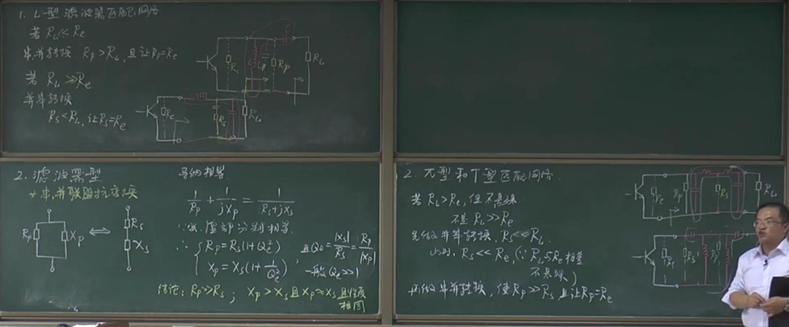

# 前言
 
课程链接：
- [《射频电路基础（高频电子线路）》 上半部合集 西安电子科技大学 邓军_哔哩哔哩_bilibili](https://www.bilibili.com/video/BV1y34y1C7mp/?spm_id_from=333.999.0.0&vd_source=f6d522f28072721da0e962ed83629041)

# 课程笔记

## 第二章 谐振功率放大器

### 1. 电路与工作原理

- 原理电路 ep.1-ep.2

注意：LC回路需谐振才能等效为Re

- 能量关系 ep.3
	- 注意：算输出功率时，因为是交流功率，要取两个有效值（故为根号2分之1* 根号2分之1，结果即为P前面带1/2）

### 2. 谐振功率放大器的工作状态

1. 解析分析法 ep.4-ep.5

2. 图解分析法（动特性曲线）ep.6

3. 丙类功放的工作状态（由C点的位置划分）ep.7

4. 丙类功放工作状态的调整
- 调节Ucc，Ubb，Ubm，Ucm（调节Re，进而调节）

1) 负载特性：调节Re时发生的变化。

	
1) 集电极调制特性：调节Ucc时发生的变化。（实现调幅，工作在过压区，且Vcc后外串一个信号即可实现调幅。）

3) 基极调制特性：调节Ubb时发生的变化。（实现调幅，工作在欠压区，且Vbb后外串一个信号即可实现调幅。）

4) 放大特性：调节Ubm时发生的变化。（与基极调制特性一致，不一样的在于横坐标的改变（定义域改变：Ubm不能为负））

### 3. 谐振功率放大器的电路设计

1. 直流馈电线路（串馈和并馈）

- 高频扼流圈（大电感，隔交通直）

2. 输出匹配网络

## 第三章 振荡器

### 1. 反馈式振荡器（三种条件：起振条件，稳定条件，平衡条件）

- （补充组成部分）

### 2. LC正弦波振荡器

1. LC正弦波振荡器

2. 三点式振荡器

3.  改进的三点式振荡器

4. 频率稳定度等

### 3. 石英晶体振荡器

### 4. RC振荡器（选学）

## 第五章 振幅调制与解调

### 1. 双边带及单边带调幅

### 2.振幅调制原理

### 3. 振幅解调

# 课程评价
